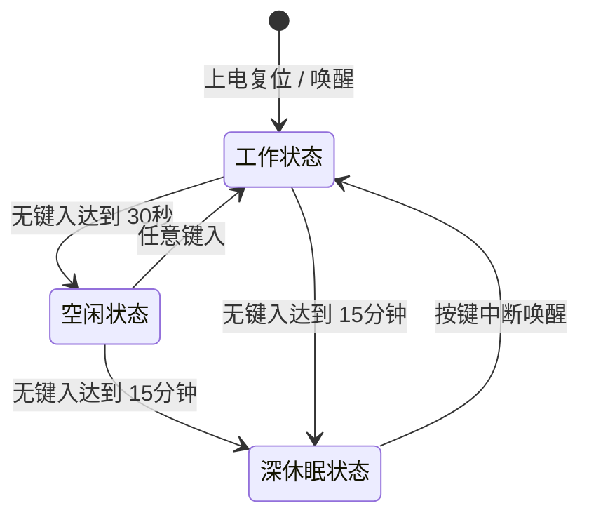

# ThinkPad Wireless Keyboard - 项目需求与规格定义说明书

本项目旨在将 **ThinkPad X220 / T420** 键盘（经典 7 行键盘，BTB 44-pin 接口）改造为**有线 USB / 蓝牙双模无线键盘**。主控采用 **nRF52840-QIAA-R0**，固件基于 **ZMK Firmware**。

---

## 1. 📋 项目需求明细 (Project Requirements)

以下为从最初项目定义中整理的 17 项核心需求：

1. **键盘兼容性**：支持 X220/T420 键盘，连接器使用 BTB 44-pin 母座，按键扫描采用 15 驱动列、8 读取行的矩阵式设计。
2. **连接模式**：支持有线 USB 和无线蓝牙双模式，具备自动切换逻辑，有线 USB 插入时优先级更高，自动切换为有线传输。
3. **锂电池供电**：支持 4.2V 单节锂电池供电，具备充电管理和充电状态指示功能。在蓝牙和 USB 模式下均可读取电池电量百分比。
4. **小红帽功能**：支持小红帽指点杆 (TrackPoint) 功能，小红帽采用 PS/2 协议进行通信。
5. **USB 接口**：采用 Type-C 接口用于数据传输和充电。
6. **键盘背光灯**：支持键盘上特定的 5 个功能指示灯/背光灯。
7. **电平兼容性**：按键扫描矩阵和主控电平为 3.3V，小红帽（TrackPoint）支持 3.3V 或 5V 供电兼容。
8. **开源固件**：固件系统基于开源的 **ZMK Firmware**。
9. **主控硬件**：主控芯片选型为 Nordic **nRF52840-QIAA-R0** (aQFN73 / QFN73 封装)。
10. **EDA 工具**：硬件设计工具采用 **KiCad** 进行原理图和 PCB 设计。
11. **蓝牙状态指示**：在键盘上增加蓝色 LED 指示灯，用于指示蓝牙状态及配对广播状态。
12. **电量状态指示**：在键盘上增加独立的电量指示灯。
13. **配对控制键**：ZMK 固件中设定使用组合键 **`Hotkey` + `Power Switch`** 进入蓝牙配对/广播模式。
14. **多设备切换键**：ZMK 固件中设定使用组合键 **`Hotkey` + `1/2/3/4/5`** 在 5 个蓝牙设备通道 (Profile 0 - 4) 之间进行快速切换。
15. **双色电量指示灯**：电量指示灯设计为 **红绿双色 LED (Red/Green Dual-color LED)**，占用 2 个独立的 GPIO 进行控制。
16. **引脚避让约束**：麦克风静音指示灯（MIC MUTE）禁止接在 `P0.30` 引脚上（由于布线限制，已在原理图中最终分配至 `P0.31` 旁的 `P1.07`）。
17. **充电芯片**：充电管理芯片选用 **TP4054-42-SOT25R** 微型线性锂电池充电芯片，充电电流由外部引脚电阻设定（如 2k 电阻对应 500mA 充电电流，禁止使用 51k 误配）。

---

## 2. 🔌 物理接口：键盘 44-pin BTB 排线引脚定义

此表定义了 **ThinkPad 键盘端 44-pin 排线** 的物理管脚和对应的逻辑信号名称（源自 `Thinkpad Keyboard hack.xlsx` 中的引脚映射表）：

| 排线 Pin | 信号名称 | 信号类型 | 功能描述 |
| :--- | :--- | :--- | :--- |
| **1** | `-HOTKEY` | Input | ThinkVantage 快捷按键信号（按下接地） |
| **2** | `DRV4` | Output | 矩阵扫描列 4 |
| **3** | `SENSE5` | Input | 矩阵扫描行 5 |
| **4** | `DRV5` | Output | 矩阵扫描列 5 |
| **5** | `SENSE0` | Input | 矩阵扫描行 0 |
| **6** | `DRV8` | Output | 矩阵扫描列 8 |
| **7** | `SENSE3` | Input | 矩阵扫描行 3 |
| **8** | `DRV6` | Output | 矩阵扫描列 6 |
| **9** | `SENSE2` | Input | 矩阵扫描行 2 |
| **10** | `DRV3` | Output | 矩阵扫描列 3 |
| **11** | `SENSE4` | Input | 矩阵扫描行 4 |
| **12** | `DRV7` | Output | 矩阵扫描列 7 |
| **13** | `SENSE1` | Input | 矩阵扫描行 1 |
| **14** | `DRV2` | Output | 矩阵扫描列 2 |
| **15** | `SENSE6` | Input | 矩阵扫描行 6 |
| **16** | `DRV10` | Output | 矩阵扫描列 10 |
| **17** | `SENSE7` | Input | 矩阵扫描行 7 |
| **18** | `DRV1` | Output | 矩阵扫描列 1 |
| **19** | `-PWRSWITCH` | Input | 电源开关按键信号（按下接地） |
| **20** | `DRV9` | Output | 矩阵扫描列 9 |
| **21** | `LEDCPSLOCK_CONN` | Output | 大写锁定 (Caps Lock) 指示灯驱动 |
| **22** | `DRV0` | Output | 矩阵扫描列 0 |
| **23** | `LEDPWR_CONN` | Output | 电源状态指示灯驱动 |
| **24** | `DRV11` | Output | 矩阵扫描列 11 |
| **25** | `KBDID0_CONN` | Input | 键盘硬件识别 ID 0 |
| **26** | `DRV14` | Output | 矩阵扫描列 14 |
| **27** | `KBDID1_CONN` | Input | 键盘硬件识别 ID 1 |
| **28** | `DRV12` | Output | 矩阵扫描列 12 |
| **29** | `KBDID2_CONN` | Input | 键盘硬件识别 ID 2 |
| **30** | `DRV15` | Output | 矩阵扫描列 15 |
| **31** | `NC` | - | 未连接 |
| **32** | `DRV13` | Output | 矩阵扫描列 13 |
| **33** | `NC` | - | 未连接 |
| **34** | `NC` | - | 未连接 |
| **35** | `-LED_MUTE` | Output | 扬声器静音指示灯驱动 |
| **36** | `-LEDMICMUTE_R` | Output | 麦克风静音指示灯驱动 |
| **37** | `TP4DATA` | I/O | 小红帽 PS/2 数据端 |
| **38** | `TP4_RESET` | Output | 小红帽复位端 |
| **39** | `TP4CLK` | I/O | 小红帽 PS/2 时钟端 |
| **40** | `NC` | - | 未连接 |
| **41** | `VCC3M_TP_FUSE` | Power | 小红帽 3.3V 供电输入 |
| **42** | `VCC5B_TP_FUSE` | Power | 小红帽 5V 供电输入（用于兼容 5V 小红帽/T61） |
| **43** | `VCC3M_TP_FUSE` | Power | 小红帽 3.3V 供电输入 |
| **44** | `VCC5B_TP_FUSE` | Power | 小红帽 5V 供电输入 |

---

## 3. 🛠️ 实际电路：PCB MCU 引脚映射与网络关系

此表定义了 **PCB 实际走线** 中，nRF52840 主控芯片管脚与上述逻辑信号的连接（源自 `SCH_Schematic1_2026-07-09.pdf` 原理图设计）：

| 信号名称 | MCU 逻辑引脚 (GPIO) | 芯片物理球位 (Ball) | 连接器引脚 (FPC2/BTB) | 作用与配置说明 |
| :--- | :--- | :--- | :--- | :--- |
| **KEY_SENSE0** | `P0.26` | `G1` | Pin 17 | 矩阵行 0 读取，`row-gpios` 分配 |
| **KEY_SENSE1** | `P0.28` | `B11` | Pin 19 | 矩阵行 1 读取，`row-gpios` 分配 |
| **KEY_SENSE2** | `P0.05` | `K2` | Pin 22 | 矩阵行 2 读取，`row-gpios` 分配 |
| **KEY_SENSE3** | `P0.04` | `J1` | Pin 23 | 矩阵行 3 读取，`row-gpios` 分配 |
| **KEY_SENSE4** | `P0.27` | `H2` | Pin 18 | 矩阵行 4 读取，`row-gpios` 分配 |
| **KEY_SENSE5** | `P0.07` | `M2` | Pin 21 | 矩阵行 5 读取，`row-gpios` 分配 |
| **KEY_SENSE6** | `P1.12` | `B17` | Pin 37 | 矩阵行 6 读取，`row-gpios` 分配 |
| **KEY_SENSE7** | `P1.14` | `B15` | Pin 38 | 矩阵行 7 读取，`row-gpios` 分配 |
| **KEY_DRV0** | `P0.13` | `AD8` | Pin 6 | 矩阵列 0 驱动，`col-gpios` 分配 |
| **KEY_DRV1** | `P0.20` | `AD16` | Pin 12 | 矩阵列 1 驱动，`col-gpios` 分配 |
| **KEY_DRV2** | `P0.22` | `AD18` | Pin 14 | 矩阵列 2 驱动，`col-gpios` 分配 |
| **KEY_DRV3** | `P0.24` | `AD20` | Pin 16 | 矩阵列 3 驱动，`col-gpios` 分配 |
| **KEY_DRV4** | `P1.01` | `Y23` | Pin 26 | 矩阵列 4 驱动，`col-gpios` 分配 |
| **KEY_DRV5** | `P0.25` | `AC21` | Pin 17 (FPC2端) | 矩阵列 5 驱动，`col-gpios` 分配 |
| **KEY_DRV6** | `P1.00` | `AD22` | Pin 25 | 矩阵列 6 驱动，`col-gpios` 分配 |
| **KEY_DRV7** | `P0.21` | `AC17` | Pin 13 | 矩阵列 7 驱动，`col-gpios` 分配 |
| **KEY_DRV8** | `P0.23` | `AC19` | Pin 15 | 矩阵列 8 驱动，`col-gpios` 分配 |
| **KEY_DRV9** | `P0.16` | `AC11` | Pin 9 | 矩阵列 9 驱动，`col-gpios` 分配 |
| **KEY_DRV10** | `P0.19` | `AC15` | Pin 11 | 矩阵列 10 驱动，`col-gpios` 分配 |
| **KEY_DRV11** | `P0.15` | `AD10` | Pin 8 | 矩阵列 11 驱动，`col-gpios` 分配 |
| **KEY_DRV12** | `P0.14` | `AC9` | Pin 7 | 矩阵列 12 驱动，`col-gpios` 分配 |
| **KEY_DRV13** | `P1.05` | `T23` | Pin 30 | 矩阵列 13 驱动，`col-gpios` 分配 |
| **KEY_DRV14** | `P0.17` | `AD12` | Pin 10 | 矩阵列 14 驱动，`col-gpios` 分配 |
| **KEY_DRV15** | `P1.03` | `V23` | Pin 28 | 矩阵列 15 驱动，`col-gpios` 分配 |
| **TP4CLK** | `P1.13` | `A16` | Pin 3 (FPC3) | 小红帽时钟，PS/2 接口 |
| **TP4DATA** | `P1.10` | `A20` | Pin 2 (FPC3) | 小红帽数据，PS/2 接口 |
| **TP4_RESET** | `P1.09` | `R1` | Pin 21 (FPC3) | 小红帽复位信号 |
| **LEDCPSLOCK** | `P0.31` | `A8` | - | 大写锁定 (Caps Lock) 指示灯 (低电平点亮) |
| **LEDPWR** | `P0.29` | `A10` | - | 电源状态指示灯 (低电平点亮) |
| **-LED_MUTE** | `P1.15` | `A14` | - | 扬声器静音指示灯 (低电平点亮) |
| **-LEDMICMUTE_R** | `P1.07` | `P23` | - | 麦克风静音指示灯 (低电平点亮) |
| **BT_LED** | `P1.02` | `W24` | - | 蓝牙指示灯 (低电平点亮) |
| **BAT_LED_R** | `P1.06` | `R24` | - | 充电红灯 (低电平点亮) |
| **BAT_LED_G** | `P1.04` | `U24` | - | 充满/充电绿灯 (低电平点亮) |
| **5V_EN** | `P0.12` | `U1` | - | **5V Boost 升压使能端 (高电平开启)** |
| **BAT_ADC** | `P0.02` | `A12` | - | 电池电压采集 (AIN0) |
| **CHG_INT** | `P0.08` | `N1` | - | 充电状态中断读取 |
| **-PWRSWITCH** | `P1.11` | `B19` | - | 电源键按键输入 (低电平触发) |
| **-HOTKEY** | `P1.08` | `P2` | - | ThinkVantage 键输入 (低电平触发) |

---

## 4. ⚡ 电源控制与休眠唤醒策略

为实现超长的待机续航并保证 TrackPoint 的兼容性（兼容部分需 5V 供电的小红帽及 T61 键盘），项目设计了动态的 5V Boost 升压电源域切换。

### 4.1 5V 升压使能 (5V Boost Control)
* 控制引脚为 `5V_EN` (`P0.12`)。
* 状态定义：
  * **拉高 (High, 3.3V)**：激活 5V 升压电路，向小红帽及外部连接器提供 5V 供电。
  * **拉低 (Low, 0V)**：关闭 5V 升压电路，关断升压芯片。此状态下升压芯片的漏电流接近为零。

### 4.2 状态转换策略 (State Transitions)

键盘通过监测用户输入及外部 PC 状态进行低功耗状态机切换：

#### 1. 工作状态 (Working State)
* **条件**：用户正常使用敲击键盘。
* **供电策略**：5V Boost 保持开启（`5V_EN` 输出高电平），小红帽指示灯和状态 LED 正常工作。
* **功耗**：数毫安级（主要为小红帽与蓝牙发射功耗）。

#### 2. 空闲状态 (Idle State)
* **触发条件**：键盘持续 **30 秒** 无任何按键敲击。
* **电源与无线策略**：
  * 主控的蓝牙连接**保持在线**（SNIFF 低功耗保持模式），与 PC 维持配对。
  * 关闭除必要状态指示外的所有 LED 指示灯，以节省电量。
  * 5V Boost 依然保持工作，保证小红帽的即时响应。
* **唤醒**：一旦有任意按键敲击，立即无缝返回工作状态。

#### 3. 深休眠状态 (Deep Sleep State)
* **触发条件**：键盘持续 **15 分钟 (900,000 ms)** 无任何按键敲击。
* **电源与无线策略**：
  * 主控切断与 PC 的蓝牙连接。
  * 彻底拉低 `5V_EN` (`P0.12` = 0)，**关闭 5V Boost 升压电路**，切断小红帽的全部供电。
  * 关闭所有外设和主控非必要时钟，主控进入 nRF52840 的 **System Off** 极低功耗模式。
* **功耗**：微安级（约 2µA-5µA），可提供数年级别的关机待机时间。

### 4.3 特殊边界场景说明 (Edge Cases)

#### 1. PC 关机 (PC Shut Down) 时的键盘行为
* **现象**：PC 关机导致蓝牙连接异常断开。
* **键盘策略**：
  * 键盘无法感知 PC 是否是主动关机，它将进入蓝牙广播配对状态，等待 PC 重新上线。
  * **休眠计时不受影响**：由于判定基准为键盘的**无操作时间**，从最后一次按键起算，达到 15 分钟后，键盘仍将准时进入“深休眠状态”，拉低 `5V_EN` 关断 5V BOOST，实现省电。
  * 区分蓝牙断开和正常深度休眠，能有效防止键盘因 PC 关机而持续发送广播信号耗尽电池。

#### 2. PC 休眠 (PC Sleep) 时的键盘行为
* **现象**：PC 主动挂起，蓝牙链路可能断开或被挂起。
* **键盘策略**：同 PC 关机场景。键盘以自身无操作计时为准，在最后一次按键起算 15 分钟后，自动切断 5V 升压电路并进入深休眠。

#### 3. 键盘唤醒路径与机制 (Wakeup Pipeline)
* **硬件唤醒通路**：当芯片处于 System Off 深休眠状态时，只有通过引脚中断才能唤醒。按键矩阵的 8 个 Sense 行引脚配置为 Sense 唤醒中断。
* **时序与唤醒流**：
  1. **按键按下**：用户按下键盘上的**任意按键**（小红帽移动无法唤醒，因为 5V 升压已关闭，小红帽无电）。
  2. **引脚边沿触发**：按键机械闭合，将对应的 Row Sense 引脚拉高，触发 GPIO 唤醒事件。
  3. **芯片重启引导 (Booting)**：nRF52840 在数十毫秒内复位并快速初始化外设。
  4. **开启 5V Boost**：固件运行的第一时间将 `5V_EN` 拉高，5V BOOST 瞬间工作，为小红帽与键盘电路完成上电初始化。
  5. **蓝牙回连**：主控启动蓝牙广播并向先前配对的 PC 发起回连。PC 接收连接后，键盘和 TrackPoint 恢复正常使用。

---

## 5. 📦 BOM 与硬件元器件设计参数

以下为项目核心硬件选型及参数要求（源自 `Thinkpad Keyboard hack.xlsx` 中的 BOM 与系统配置表）：

| 模块 | 器件参考型号 | 设计说明与参数要求 |
| :--- | :--- | :--- |
| **供电配置** | `Normal Voltage` 模式 | 由于外部电路提供固定的 3.3V 稳压，主控芯片必须短接 `VDDH` 与 `VDD`，禁用内部高电压调节器 (REG0)。 |
| **主控芯片** | `nRF52840-QIAA-R0` | aQFN73 / QFN73 封装。提供 48 个 GPIO。严格遵守规格书电源退耦要求及引脚分配规范。 |
| **BTB 连接器** | `Molex 54363-0489` | 44-Pin 板对板连接器公座。用于精确匹配 X220 键盘端的 44-pin 排线插口。 |
| **充电芯片** | `TP4054-42-SOT25R` | 线性恒流锂电池充电芯片，SOT-25-5 封装。必须配合合理的 PROG 电阻设定充电电流（如 2k 电阻对应 500mA 恒流充电），禁止使用不匹配电阻。 |
| **稳压 LDO** | `RT9080-33GJ5` (或 SGM2036-3.3) | 超低静态功耗 3.3V LDO。静态功耗 Iq 仅为 **2µA**，最大支持 600mA 输出。比 ME6211 (Iq=40µA) 更符合低功耗无线外设需求，提供更高的待机效率。 |
| **高频晶振** | `32MHz` 无源晶振 | 精度要求 $\pm$10ppm，封装规格 2520。 |
| **低频晶振** | `32.768kHz` 无源晶振 | 精度要求 $\pm$20ppm，封装规格 3215。用于低功耗定时与睡眠计时。 |
| **阻容规格** | 贴片阻容感 | 射频匹配链路使用 0402 封装以保证阻抗匹配与体积；其余常规去耦、滤波、限流阻容感统一使用 0603 封装，便于手贴及调试。 |
| **USB 接口** | `16-pin Type-C` 母座 | 为了完美兼容 USB-C to USB-C 充电线（CC 握手协议），其 CC1 和 CC2 引脚必须分别单独接 5.1k$\Omega$ 电阻下拉到 GND。 |