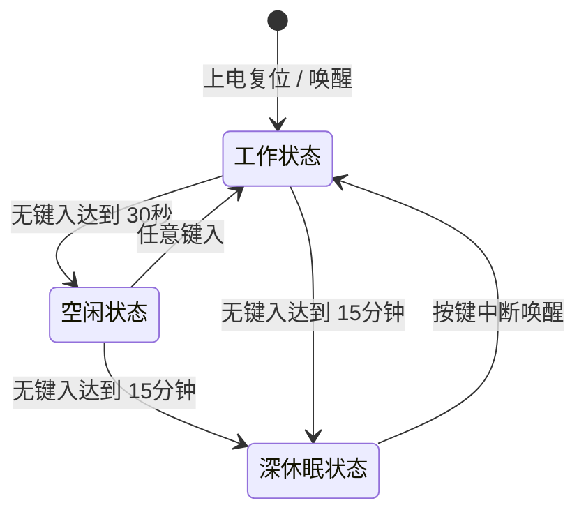

# ThinkPad Wireless Keyboard - 项目需求与规格定义说明书

本项目旨在将 **ThinkPad X220 / T420** 键盘（经典 7 行键盘，BTB 44-pin 接口）改造为**有线 USB / 蓝牙双模无线键盘**。主控采用 **nRF52840-QIAA-R0**，固件基于 **ZMK Firmware**。

---

## 1. 🔌 完整 GPIO 引脚映射表 (Pin Mapping)

以下是基于最终原理图 `SCH_Schematic1_2026-07-09.pdf` 提取的完整 GPIO 分配表。此表为固件 DeviceTree（DTS）和硬件调试的唯一数据源。

### 1.1 键盘扫描矩阵 (Keyboard Matrix)
键盘矩阵采用 **8 行 (Sense) x 16 列 (Drive)** 设计，二极管方向为 **Column-to-Row (col2row)**。

* **行读取引脚 (Sense / row-gpios)**：配置为输入，低电平空闲，高电平触发（带内部下拉 `GPIO_PULL_DOWN`）。
* **列驱动引脚 (Drive / col-gpios)**：配置为输出，推挽输出，高电平有效（`GPIO_ACTIVE_HIGH`）。

| 信号名称 | MCU 逻辑引脚 (GPIO) | 芯片物理球位 (Ball) | 连接器引脚 (FPC2/BTB) | 描述 |
| :--- | :--- | :--- | :--- | :--- |
| **KEY_SENSE0** | `P0.26` | `G1` | Pin 17 | 矩阵行 0 读取 |
| **KEY_SENSE1** | `P0.28` | `B11` | Pin 19 | 矩阵行 1 读取 |
| **KEY_SENSE2** | `P0.05` | `K2` | Pin 22 | 矩阵行 2 读取 |
| **KEY_SENSE3** | `P0.04` | `J1` | Pin 23 | 矩阵行 3 读取 |
| **KEY_SENSE4** | `P0.27` | `H2` | Pin 18 | 矩阵行 4 读取 |
| **KEY_SENSE5** | `P0.07` | `M2` | Pin 21 | 矩阵行 5 读取 |
| **KEY_SENSE6** | `P1.12` | `B17` | Pin 37 | 矩阵行 6 读取 |
| **KEY_SENSE7** | `P1.14` | `B15` | Pin 38 | 矩阵行 7 读取 |
| **KEY_DRV0** | `P0.13` | `AD8` | Pin 6 | 矩阵列 0 驱动 |
| **KEY_DRV1** | `P0.20` | `AD16` | Pin 12 | 矩阵列 1 驱动 |
| **KEY_DRV2** | `P0.22` | `AD18` | Pin 14 | 矩阵列 2 驱动 |
| **KEY_DRV3** | `P0.24` | `AD20` | Pin 16 | 矩阵列 3 驱动 |
| **KEY_DRV4** | `P1.01` | `Y23` | Pin 26 | 矩阵列 4 驱动 |
| **KEY_DRV5** | `P0.25` | `AC21` | Pin 17 (FPC2端) | 矩阵列 5 驱动 |
| **KEY_DRV6** | `P1.00` | `AD22` | Pin 25 | 矩阵列 6 驱动 |
| **KEY_DRV7** | `P0.21` | `AC17` | Pin 13 | 矩阵列 7 驱动 |
| **KEY_DRV8** | `P0.23` | `AC19` | Pin 15 | 矩阵列 8 驱动 |
| **KEY_DRV9** | `P0.16` | `AC11` | Pin 9 | 矩阵列 9 驱动 |
| **KEY_DRV10** | `P0.19` | `AC15` | Pin 11 | 矩阵列 10 驱动 |
| **KEY_DRV11** | `P0.15` | `AD10` | Pin 8 | 矩阵列 11 驱动 |
| **KEY_DRV12** | `P0.14` | `AC9` | Pin 7 | 矩阵列 12 驱动 |
| **KEY_DRV13** | `P1.05` | `T23` | Pin 30 | 矩阵列 13 驱动 |
| **KEY_DRV14** | `P0.17` | `AD12` | Pin 10 | 矩阵列 14 驱动 |
| **KEY_DRV15** | `P1.03` | `V23` | Pin 28 | 矩阵列 15 驱动 |

### 1.2 小红帽指点杆 (TrackPoint)
小红帽通过标准的 **PS/2 协议** 与主控通信，需要上拉电阻。

| 信号名称 | MCU 逻辑引脚 (GPIO) | 芯片物理球位 (Ball) | 连接器引脚 (FPC3) | 描述 |
| :--- | :--- | :--- | :--- | :--- |
| **TP4CLK** | `P1.13` | `A16` | Pin 3 | PS/2 时钟信号，需外部 4.7k 上拉至 3.3V |
| **TP4DATA** | `P1.10` | `A20` | Pin 2 | PS/2 数据信号，需外部 4.7k 上拉至 3.3V |
| **TP4_RESET** | `P1.09` | `R1` | Pin 21 | 小红帽复位引脚 |

### 1.3 状态指示灯 & 系统信号 (LEDs & System Control)

| 信号名称 | MCU 逻辑引脚 (GPIO) | 芯片物理球位 (Ball) | 动作电平 | 描述 |
| :--- | :--- | :--- | :--- | :--- |
| **LEDCPSLOCK** | `P0.31` | `A8` | `GPIO_ACTIVE_LOW` | 大写锁定 (Caps Lock) 指示灯 |
| **LEDPWR** | `P0.29` | `A10` | `GPIO_ACTIVE_LOW` | 系统电源状态指示灯 |
| **-LED_MUTE** | `P1.15` | `A14` | `GPIO_ACTIVE_LOW` | 扬声器静音指示灯 |
| **-LEDMICMUTE_R** | `P1.07` | `P23` | `GPIO_ACTIVE_LOW` | 麦克风静音指示灯 |
| **BT_LED** | `P1.02` | `W24` | `GPIO_ACTIVE_LOW` | 蓝牙配对与状态指示灯 |
| **BAT_LED_R** | `P1.06` | `R24` | `GPIO_ACTIVE_LOW` | 充电指示红灯 |
| **BAT_LED_G** | `P1.04` | `U24` | `GPIO_ACTIVE_LOW` | 充电/充满指示绿灯 |
| **-PWRSWITCH** | `P1.11` | `B19` | `GPIO_ACTIVE_LOW` | 电源开关按键输入（硬件上拉，按下接地） |
| **-HOTKEY** | `P1.08` | `P2` | `GPIO_ACTIVE_LOW` | ThinkVantage 键输入（硬件上拉，按下接地） |
| **5V_EN** | `P0.12` | `U1` | `GPIO_ACTIVE_HIGH` | **5V Boost 升压使能端**（控制整个 5V BOOST 电路） |
| **BAT_ADC** | `P0.02` | `A12` | 模拟输入 (AIN0) | 电池电压读取点（连接至 10M/10M 阻抗分压网络） |
| **CHG_INT** | `P0.08` | `N1` | 输入中断 | 锂电池充电状态变化中断读取 |

---

## 2. ⚡ 电源控制与休眠唤醒策略

为实现超长的待机续航并保证 TrackPoint 的兼容性（兼容部分需 5V 供电的小红帽及 T61 键盘），项目设计了动态的 5V Boost 升压电源域切换。

### 2.1 5V 升压使能 (5V Boost Control)
* 控制引脚为 `5V_EN` (`P0.12`)。
* 状态定义：
  * **拉高 (High, 3.3V)**：激活 5V 升压电路，向小红帽及外部连接器提供 5V 供电。
  * **拉低 (Low, 0V)**：关闭 5V 升压电路，关断升压芯片。此状态下升压芯片的漏电流接近为零。

### 2.2 状态转换策略 (State Transitions)

键盘通过监测用户输入及外部 PC 状态进行低功耗状态机切换：

#### 1. 工作状态 (Working State)
* **条件**：用户正常使用敲击键盘。
* **供电策略**：5V Boost 保持开启（`5V_EN` 输出高电平），小红帽指示灯和状态 LED 正常工作。
* **功耗**：数毫安级（主要为小红帽与蓝牙发射功耗）。

#### 2. 空闲状态 (Idle State)
* **触发条件**：键盘持续 **30 秒** 无任何按键敲击。
* **电源与无线策略**：
  * 主控的蓝牙连接**保持在线**（SNIFF 低功耗保持模式），与 PC 维持配对。
  * 关闭除必要状态指示外的所有 LED 指示灯，以节省电量。
  * 5V Boost 依然保持工作，保证小红帽的即时响应。
* **唤醒**：一旦有任意按键敲击，立即无缝返回工作状态。

#### 3. 深休眠状态 (Deep Sleep State)
* **触发条件**：键盘持续 **15 分钟 (900,000 ms)** 无任何按键敲击。
* **电源与无线策略**：
  * 主控切断与 PC 的蓝牙连接。
  * 彻底拉低 `5V_EN` (`P0.12` = 0)，**关闭 5V Boost 升压电路**，切断小红帽的全部供电。
  * 关闭所有外设和主控非必要时钟，主控进入 nRF52840 的 **System Off** 极低功耗模式。
* **功耗**：微安级（约 2µA-5µA），可提供数年级别的关机待机时间。

---

### 2.3 特殊边界场景说明 (Edge Cases)

#### 1. PC 关机 (PC Shut Down) 时的键盘行为
* **现象**：PC 关机导致蓝牙连接异常断开。
* **键盘策略**：
  * 键盘无法感知 PC 是否是主动关机，它将进入蓝牙广播配对状态，等待 PC 重新上线。
  * **休眠计时不受影响**：由于判定基准为键盘的**无操作时间**，从最后一次按键起算，达到 15 分钟后，键盘仍将准时进入“深休眠状态”，拉低 `5V_EN` 关断 5V BOOST，实现省电。
  * 这样做可以有效防止因 PC 关机而导致键盘整夜处于广播状态，耗尽电池。

#### 2. PC 休眠 (PC Sleep) 时的键盘行为
* **现象**：PC 主动挂起，蓝牙链路可能断开或被挂起。
* **键盘策略**：同 PC 关机场景。键盘以自身无操作计时为准，在最后一次按键起算 15 分钟后，自动切断 5V 升压电路并进入深休眠。

#### 3. 键盘唤醒路径与机制 (Wakeup Pipeline)
* **硬件唤醒通路**：当芯片处于 System Off 深休眠状态时，只有通过引脚中断才能唤醒。按键矩阵的 8 个 Sense 行引脚配置为 Sense 唤醒中断。
* **时序与唤醒流**：
  1. **按键按下**：用户按下键盘上的**任意按键**（小红帽移动无法唤醒，因为 5V 升压已关闭，小红帽无电）。
  2. **引脚边沿触发**：按键机械闭合，将对应的 Row Sense 引脚拉高，触发 GPIO 唤醒事件。
  3. **芯片重启引导 (Booting)**：nRF52840 在数十毫秒内复位并快速初始化外设。
  4. **开启 5V Boost**：固件运行的第一时间将 `5V_EN` 拉高，5V BOOST 瞬间工作，为小红帽与键盘电路完成上电初始化。
  5. **蓝牙回连**：主控启动蓝牙广播并向先前配对的 PC 发起回连。PC 接收连接后，键盘和 TrackPoint 恢复正常使用。