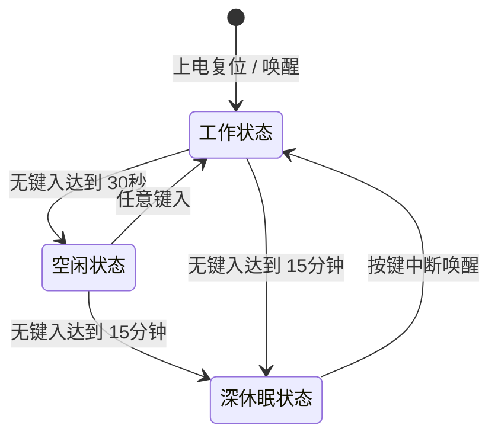

# ThinkPad Wireless Keyboard - 项目需求与规格定义说明书

本项目旨在将 **ThinkPad X220 / T420** 键盘（经典 7 行键盘，使用 40-pin BTB 接口）和 **T61** 键盘（40-pin FPC 接口）通过适配电路，改造为**有线 USB / 蓝牙双模无线键盘**。主控采用 **nRF52840-QIAA-R0**，固件基于 **ZMK Firmware**。

---

## 1. 📋 项目需求明细 (Project Requirements)

以下为整理自项目初期的 17 项核心需求明细：

1. **键盘兼容性**：同时支持 X220/T420 键盘和 T61 键盘。扫描矩阵采用 15 驱动列 (Drive)、8 读取行 (Sense) 结构。
2. **连接模式**：支持有线 USB 和无线蓝牙双模式，具备自动切换逻辑，有线 USB 插入时自动切换为有线传输（USB 优先级更高）。
3. **锂电池供电**：支持 4.2V 单节锂电池供电，具备充电管理和充电状态指示功能。在蓝牙和 USB 模式下均可读取电池电量百分比。
4. **小红帽功能**：支持小红帽指点杆 (TrackPoint) 功能，小红帽采用 PS/2 协议进行通信。
5. **USB 接口**：采用 Type-C 接口用于数据传输和充电。
6. **键盘背光灯**：支持键盘上特定的 5 个功能指示灯/背光灯（包括大写锁定灯、电源状态灯、静音灯、麦克风静音灯等）。
7. **电平兼容性**：按键扫描矩阵和主控电平为 3.3V，小红帽（TrackPoint）支持 3.3V 或 5V 供电兼容。
8. **开源固件**：固件系统基于开源的 **ZMK Firmware**。
9. **主控硬件**：主控芯片选型为 Nordic **nRF52840-QIAA-R0** (aQFN73 / QFN73 封装)。
10. **EDA 工具**：硬件设计工具采用 **KiCad** 进行原理图和 PCB 设计。
11. **蓝牙状态指示**：在键盘上增加蓝色 LED 指示灯，用于指示蓝牙状态及配对广播状态。
12. **电量状态指示**：在键盘上增加独立的电量指示灯。
13. **配对控制键**：ZMK 固件中设定使用组合键 **`Hotkey` + `Power Switch`** 进入蓝牙配对/广播模式。
14. **多设备切换键**：ZMK 固件中设定使用组合键 **`Hotkey` + `1/2/3/4/5`** 在 5 个蓝牙设备通道 (Profile 0 - 4) 之间进行快速切换。
15. **双色电量指示灯**：电量指示灯设计为 **红绿双色 LED (Red/Green Dual-color LED)**，占用 2 个独立的 GPIO 进行控制。
16. **引脚避让约束**：麦克风静音指示灯（MIC MUTE）禁止接在 `P0.30` 引脚上（已在原理图中最终分配至 `P0.31` 旁的 `P1.07`）。
17. **充电芯片**：充电管理芯片选用 **TP4054-42-SOT25R** 微型线性锂电池充电芯片，充电电流由外部引脚电阻设定（使用 2k 电阻对应 500mA 恒流充电，防止错配）。

---

## 2. 🔌 完整接口与 GPIO 引脚映射表 (Pin Mapping)

以下是经原理图 `SCH_Schematic1_2026-07-09.pdf` 最终确认的信号映射关系。包含：
*   **MCU GPIO / Ball**：nRF52840 控制引脚与芯片球位。
*   **FPC3 (主控板端)**：主控板上的 40-Pin FPC 插座，用于接收来自转接板的键盘与小红帽信号。
*   **FPC2 (转接板端)**：键盘转接板上的 40-Pin FPC 插座。无论是 X220 还是 T61 键盘，均需要通过各自专属的转接板转换引脚，并由 FPC2 输出。
*   **U2 (X220 BTB)**：转接板上用于连接 X220 经典键盘的 40-Pin 板对板插座（另含 4 个屏蔽脚）。

| 信号名称 | MCU引脚 (GPIO) | MCU物理球位 (Ball) | FPC3引脚 (主控板端) | U2引脚 (X220 BTB) | FPC2引脚 (转接板端) | 描述 / 配置参数 |
| :--- | :--- | :--- | :--- | :--- | :--- | :--- |
| **KEY_SENSE0** | `P0.26` | `G1` | Pin 17 | Pin 5 | Pin 24 | 矩阵行 0 读取，带内部下拉 |
| **KEY_SENSE1** | `P0.28` | `B11` | Pin 13 | Pin 13 | Pin 28 | 矩阵行 1 读取，带内部下拉 |
| **KEY_SENSE2** | `P0.05` | `K2` | Pin 15 | Pin 9 | Pin 26 | 矩阵行 2 读取，带内部下拉 |
| **KEY_SENSE3** | `P0.04` | `J1` | Pin 16 | Pin 7 | Pin 25 | 矩阵行 3 读取，带内部下拉 |
| **KEY_SENSE4** | `P0.27` | `H2` | Pin 14 | Pin 11 | Pin 27 | 矩阵行 4 读取，带内部下拉 |
| **KEY_SENSE5** | `P0.07` | `M2` | Pin 18 | Pin 3 | Pin 23 | 矩阵行 5 读取，带内部下拉 |
| **KEY_SENSE6** | `P1.12` | `B17` | Pin 11 | Pin 17 | Pin 30 | 矩阵行 6 读取，带内部下拉 |
| **KEY_SENSE7** | `P1.14` | `B15` | Pin 12 | Pin 15 | Pin 29 | 矩阵行 7 读取，带内部下拉 |
| **KEY_DRV0** | `P0.13` | `AD8` | Pin 30 | Pin 22 | Pin 11 | 矩阵列 0 驱动，推挽输出高电平 |
| **KEY_DRV1** | `P0.20` | `AD16` | Pin 32 | Pin 18 | Pin 9 | 矩阵列 1 驱动，推挽输出高电平 |
| **KEY_DRV2** | `P0.22` | `AD18` | Pin 34 | Pin 14 | Pin 7 | 矩阵列 2 驱动，推挽输出高电平 |
| **KEY_DRV3** | `P0.24` | `AD20` | Pin 36 | Pin 10 | Pin 5 | 矩阵列 3 驱动，推挽输出高电平 |
| **KEY_DRV4** | `P1.01` | `Y23` | Pin 40 | Pin 2 | Pin 1 | 矩阵列 4 驱动，推挽输出高电平 |
| **KEY_DRV5** | `P0.25` | `AC21` | Pin 39 | Pin 4 | Pin 2 | 矩阵列 5 驱动，推挽输出高电平 |
| **KEY_DRV6** | `P1.00` | `AD22` | Pin 37 | Pin 8 | Pin 4 | 矩阵列 6 驱动，推挽输出高电平 |
| **KEY_DRV7** | `P0.21` | `AC17` | Pin 35 | Pin 12 | Pin 6 | 矩阵列 7 驱动，推挽输出高电平 |
| **KEY_DRV8** | `P0.23` | `AC19` | Pin 38 | Pin 6 | Pin 3 | 矩阵列 8 驱动，推挽输出高电平 |
| **KEY_DRV9** | `P0.16` | `AC11` | Pin 31 | Pin 20 | Pin 10 | 矩阵列 9 驱动，推挽输出高电平 |
| **KEY_DRV10** | `P0.19` | `AC15` | Pin 33 | Pin 16 | Pin 8 | 矩阵列 10 驱动，推挽输出高电平 |
| **KEY_DRV11** | `P0.15` | `AD10` | Pin 29 | Pin 24 | Pin 12 | 矩阵列 11 驱动，推挽输出高电平 |
| **KEY_DRV12** | `P0.14` | `AC9` | Pin 27 | Pin 28 | Pin 14 | 矩阵列 12 驱动，推挽输出高电平 |
| **KEY_DRV13** | `P1.05` | `T23` | Pin 25 | Pin 32 | Pin 16 | 矩阵列 13 驱动，推挽输出高电平 |
| **KEY_DRV14** | `P0.17` | `AD12` | Pin 28 | Pin 26 | Pin 13 | 矩阵列 14 驱动，推挽输出高电平 |
| **KEY_DRV15** | `P1.03` | `V23` | Pin 26 | Pin 30 | Pin 15 | 矩阵列 15 驱动，推挽输出高电平 |
| **TP4CLK** | `P1.13` | `A16` | Pin 3 | Pin 39 | Pin 38 | 小红帽时钟，PS/2 协议端 |
| **TP4DATA** | `P1.10` | `A20` | Pin 2 | Pin 37 | Pin 39 | 小红帽数据，PS/2 协议端 |
| **TP4_RESET** | `P1.09` | `R1` | Pin 21 | Pin 40 (via R15) | Pin 20 | 小红帽复位端信号 |
| **LEDCPSLOCK** | `P0.31` | `A8` | Pin 9 | Pin 21 (via R18) | Pin 32 | 大写锁定指示灯 (低电平亮) |
| **LEDPWR** | `P0.29` | `A10` | Pin 8 | Pin 23 (via R19) | Pin 33 | 电源状态指示灯 (低电平亮) |
| **-LED_MUTE** | `P1.15` | `A14` | Pin 7 | Pin 33 (via R17) | Pin 34 | 扬声器静音指示灯 (低电平亮) |
| **-LEDMICMUTE_R** | `P1.07` | `P23` | Pin 23 | Pin 36 (via R16) | Pin 18 | 麦克风静音指示灯 (低电平亮) |
| **BT_LED** | `P1.02` | `W24` | - | - | - | 板载蓝牙状态指示灯 (低电平亮) |
| **BAT_LED_R** | `P1.06` | `R24` | - | - | - | 板载充电红灯 (低电平亮) |
| **BAT_LED_G** | `P1.04` | `U24` | - | - | - | 板载充满绿灯 (低电平亮) |
| **5V_EN** | `P0.12` | `U1` | - | - | - | 5V Boost 升压使能端 (高电平开启) |
| **BAT_ADC** | `P0.02` | `A12` | - | - | - | 电池分压检测输入 (SAADC AIN0) |
| **CHG_INT** | `P0.08` | `N1` | - | - | - | 锂电池充电状态变化中断引脚 |
| **-PWRSWITCH** | `P1.11` | `B19` | Pin 10 | Pin 19 | Pin 31 | 电源键按键输入 (低电平有效) |
| **-HOTKEY** | `P1.08` | `P2` | Pin 19 | Pin 1 | Pin 22 | ThinkVantage 键按键输入 (低电平有效) |
| **VDD3V3** | - | - | Pin 5 | Pin 36 | Pin 35 | 3.3V 系统电源供电网络 |
| **VDD3V3/5V (Selectable)** | - | - | Pin 22 | Pin 19 | Pin 38 | 可选系统主电源（由 R22 (0R) 选 5V，R23 (NC) 选 3.3V） |
| **GND** | - | - | Pin 1,4,6,20, 24,41,42 | Pin 31,34,41-44 | Pin 17,21,35, 37,40-42 | 公共接地端 |

---

## 3. 📦 BOM 与硬件元器件设计参数

以下为基于原理图设计总结的完整核心器件选型及参数定义：

1. **主控 MCU (`U4`)**：`nRF52840-QIAA-R0` (aQFN73 封装)。配置为 **Normal Voltage** 供电模式，即 `VDDH` 与 `VDD` 必须短接并输入 3.3V，禁用内部高电压调节器 (REG0)。
2. **系统稳压 LDO (`U5`)**：`RT9080-33GJ5` (或 SGM2036-3.3)，TSOT-23-5 封装。超低静态电流 **Iq = 2µA**，最大持续输出电流 **600mA**，低压差 (dropout)，专为蓝牙低功耗外设优化。
3. **锂电池充电芯片 (`U3`)**：`TP4054-42-SOT25R` (SOT-25-5 封装)，线性恒流/恒压充电芯片。PROG 设定引脚必须接 **2k ohm** 精密电阻以提供 500mA 恒流充电（防止大容量电池充电过慢，禁用不匹配的 51k ohm 电阻）。
4. **5V Boost 升压芯片 (`U7`)**：`ETA1061V50S2G` (SOT-23-6 封装)，高效同步整流 DC-DC 升压芯片。提供稳定 5.0V 供电输出（兼容 5V 小红帽及 T61 键盘供电）。具备超低静态电流与 **True Shutdown (真关断)** 功能，当 `EN` 为低电平时，完全关断并隔离负载与输入，避免负载端产生任何漏电流。
5. **接口 ESD 防静电保护 (`D1`, `D3`)**：`PESD5V0U2BT,215` (SOT-23 封装)，用于 USB 数据线及小红帽 PS/2 信号线的防静电防护。
6. **无源高频晶振 (`X2`)**：`32MHz` 无源晶振，封装规格 2520，频率精度要求 $\pm$10ppm 以保证蓝牙射频稳定。
7. **无源低频晶振 (`X1`)**：`32.768kHz` 无源晶振，封装规格 3215 (如 FC-135R)，用于休眠模式下低功耗定时和时钟校准。
8. **外围去耦/匹配阻容**：
    *   主控天线 RF 匹配链路电感、电容统一采用 **0402** 封装。
    *   常规电源滤波去耦电容、限流电阻统一采用 **0603** 封装，兼顾体积与手动焊接调试的便利性。
9. **USB Type-C 接口 (`USB2`)**：`16-pin Type-C` 贴片母座。为了完美兼容 USB-C to USB-C 充电线（支持 PD/CC 充电握手），其 CC1 与 CC2 引脚必须分别单独接 **5.1k ohm** 下拉电阻到 GND。
10. **键盘接口连接器**：
    *   **U2 (X220 BTB Receptacle)**：`Molex 54363-0489` (40-Pin 双排 BTB 母座，另含 4 个金属屏蔽接地脚 41-44)。
    *   **FPC2 (T61 FPC Receptacle)**：`AFC01-S40FCA-00` (40-Pin FPC 插座，0.5mm 间距，下接插类型)。
    *   **FPC3 (板级连接器)**：`AFC01-S40FCA-00` (40-Pin FPC 插座)。

---

## 4. ⚡ 电源控制与电池低压休眠保护策略

为实现极长待机寿命并保证指点杆 (TrackPoint) 的兼容性，项目设计了基于 `5V_EN` (`P0.12`) 控制引脚的动态电源域切换机制，以及底层的电池阶梯电压管理逻辑。

### 4.1 状态转换策略 (State Transitions)

*   **工作状态 (Working State)**：
    *   当用户键入或移动指点杆时，`5V_EN` (`P0.12`) 输出高电平（3.3V），激活 5V 升压电路（`ETA1061`），为小红帽电路提供 5V 供电。
*   **空闲状态 (Idle State)**：
    *   持续 **30 秒** 无任何按键敲击。
    *   主控的蓝牙连接**保持在线**（与 PC 维持连接），关闭除电源指示外的所有指示 LED， 5V Boost 保持工作，确保小红帽瞬间反应。
*   **深休眠状态 (Deep Sleep State)**：
    *   键盘持续 **15 分钟 (900,000 ms)** 无操作。
    *   断开与 PC 的蓝牙，主控进入 nRF52840 **System Off** 极低功耗模式。
    *   拉低 `5V_EN` (`P0.12` = 0V)，**彻底关闭 5V Boost**。由于 `ETA1061` 支持 True Shutdown，小红帽的待机功耗被切断，主板静态待机电流仅为 **~2µA** 级别。
    *   如果 PC 关机或休眠，键盘蓝牙连接断开并持续广播，从最后一次键入起算达到 15 分钟后同样会进入此“深休眠状态”，拉低 `5V_EN` 以保护电池。
*   **唤醒路径**：
    *   按下键盘的**任意按键**（小红帽移动无法唤醒，因为已断电），按键闭合产生的电平变化触发 row-gpios 的 Sense 唤醒中断。
    *   芯片瞬间复位引导（数十毫秒），固件启动后第一时间将 `5V_EN` 拉高开启 5V Boost，为小红帽上电复位，同时自动向绑定的 PC 蓝牙通道发送回连请求。

### 4.2 锂电池阶梯电压管理与 RG 指示灯显示策略
系统采用 4.2V 单节锂电池供电，通过板级驱动 `board.c` 实时读取硬件 ADC (AIN0) 的电压数据，并遵循以下电源管理机制：
1.  **3.4V 关机保护（0% 电量）**：
    *   当电池电压低于 **3.4V** 时，系统认为电量耗尽，红色电池指示灯 (`BAT_LED_R`) **快速闪烁 5 次**，然后键盘立即进入 **System Off** 极低功耗睡眠，防止电池过放损坏。此电压检测在系统启动时和运行过程中（每 10 秒）自动运行。
2.  **唤醒电量灯光指示**：
    *   当键盘被唤醒启动时，指示灯会显示 **5 秒** 电池电量状态：
        *   电压 **< 3.5V** 时：**红灯常亮 5 秒**，绿灯关闭（提示电量过低需要充电）。
        *   电压 **≥ 3.5V** 时：**绿灯常亮 5 秒**，红灯关闭。
        *   显示 5 秒后，指示灯**全部自动关闭**以极大节省工作模式下的电量损耗。
3.  **充电显示模式**：
    *   若插入 USB 有线电缆（VBUS 处于高电平），指示灯将覆盖上述 5 秒熄灭机制，**常亮显示充电状态**：
        *   正在充电时 (`CHG_INT` = 0)：**红灯常亮，绿灯熄灭**。
        *   充电完成时 (`CHG_INT` = 1)：**绿灯常亮，红灯熄灭**。

---

## 5. 🖱️ 小红帽指点杆 (TrackPoint) 配置与驱动

小红帽指点杆基于 PS/2 协议实现，通过 ZMK 模块和硬件引脚配置完成驱动整合：
*   **驱动依赖**：固件整合了 ZMK 社区指点杆驱动模块 `kb_zmk_ps2_mouse_trackpoint_driver` (by `infused-kim`)，采用 GPIO 模拟 bit-banging 方式实现高精度 PS/2 通信。
*   **物理管脚绑定**：
    *   `TP4CLK` -> `P1.13` (CLK 信号，开启内部上拉)
    *   `TP4DATA` -> `P1.10` (DATA 信号，开启内部上拉)
    *   `TP4_RESET` -> `P1.09` (RESET 信号，配置为低电平复位)
*   **软件配置**：
    *   在 `defconfig` 中配置 `CONFIG_ZMK_POINTING=y` 启用 ZMK 指向设备框架。
    *   通过 `input-listener` 将鼠标 X/Y 轴的相对坐标偏移直接注入 ZMK 系统，支持高灵敏度的小红帽手感调节。
